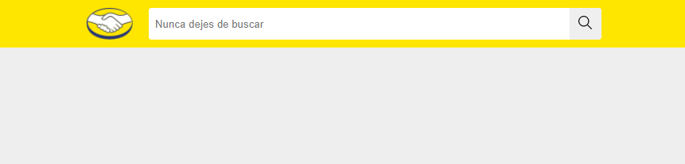
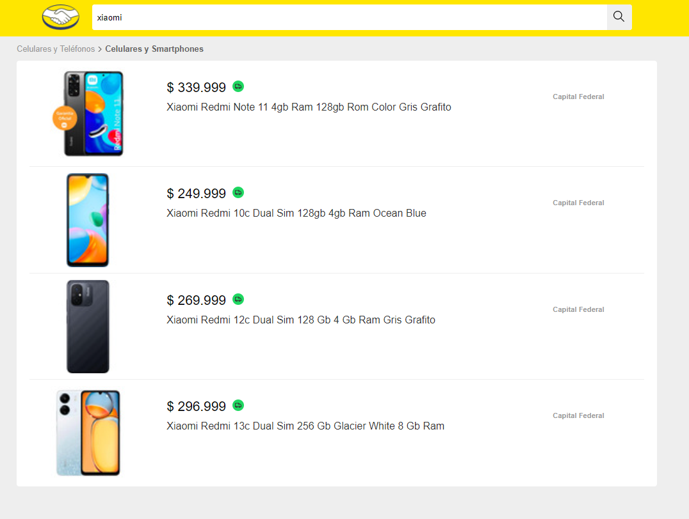
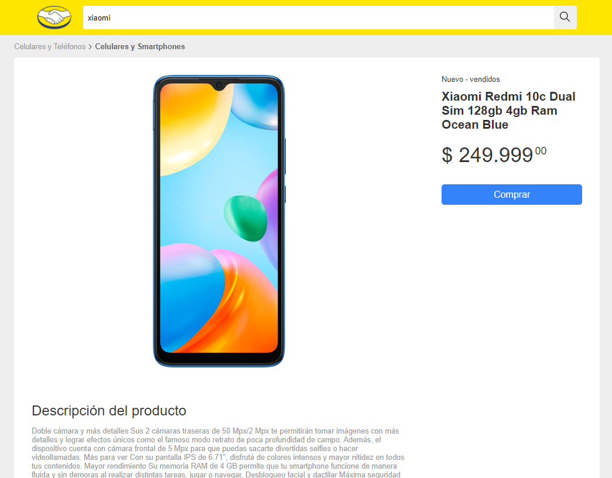

# Test Práctico - Frontend | Mercado Libre

La aplicación consta de tres componentes principales: la caja de búsqueda, la visualización de
resultados, y la descripción del detalle del producto.

## Cliente
* HTML
* Javascript y Typescript en React
* Sass

Comandos:
```shell
cd client
npm install
npm start
```

## Servidor
* Node
* Express

Comandos:
```shell
cd server
npm install
npm start
```


## Caja de busqueda


## Resultados de búsqueda


## Detalle de Producto
